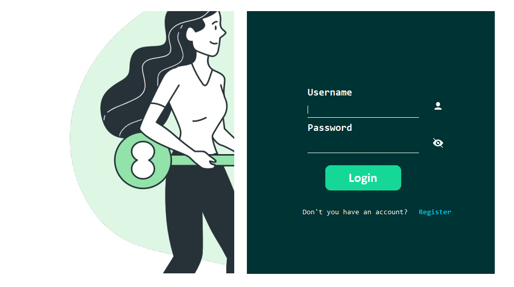
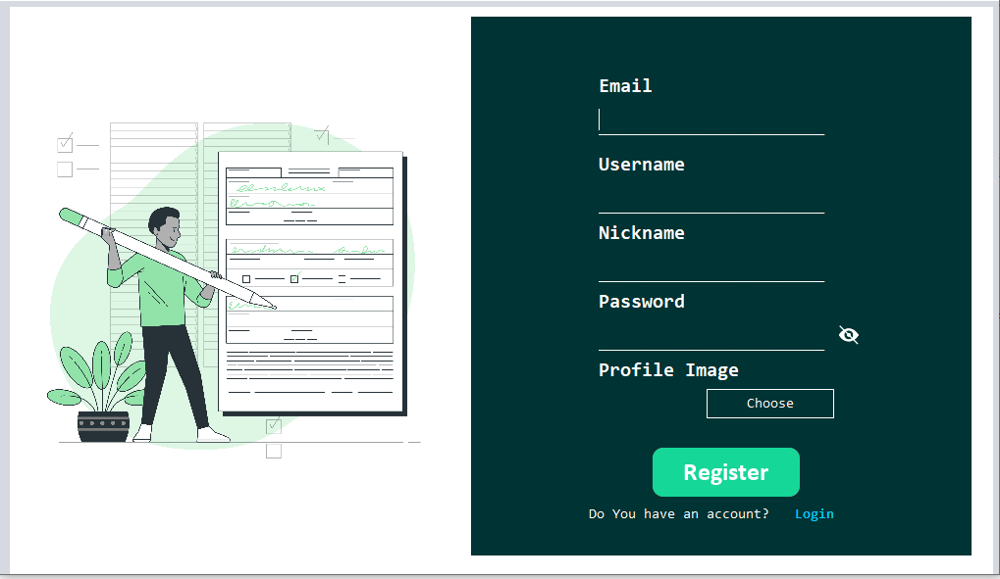
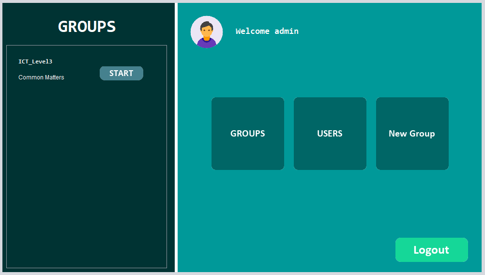
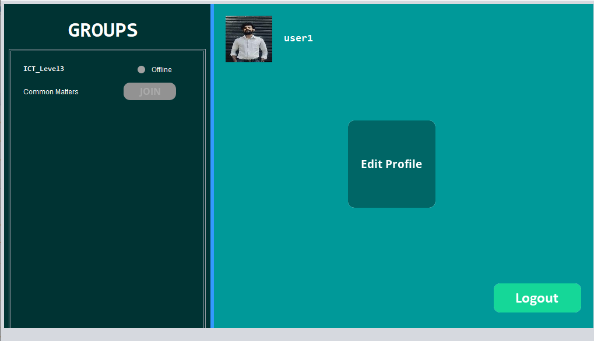
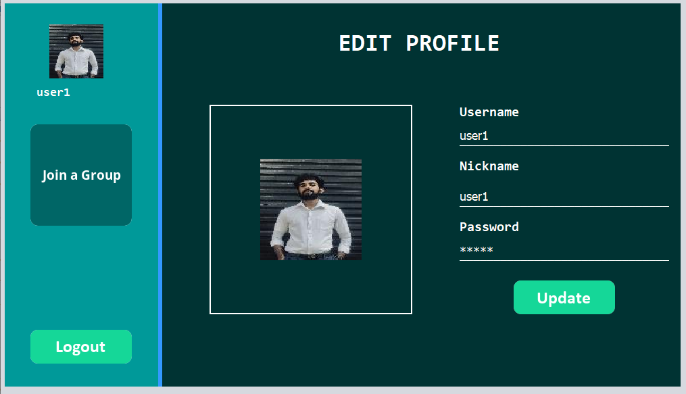
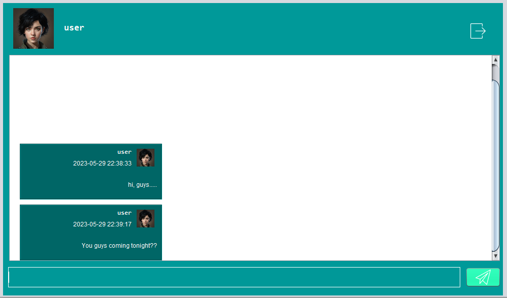

# Java RMI Chat Application
A simple Java RMI(Remote Method Invocation) Chat Application that multiple users can chat in a Chat Group Designed and Developed using java Swing as the main Interface design library , Hibernate as the ORM(Object Relational Mapping) tool and MYSQL as the relational Database.

## The Main Login GUI(Designed Usign Java-Swing)

## User Registration Form

## Admin Dashboard

## User Dashboard

## Edit Profile Window

## Main Chat Interface

## ____Pre Requirements_____

* JDK 8 or Later Installed
* Netbeans 10 or Later Installed
* MYSQL installed
* Hibernate installed
